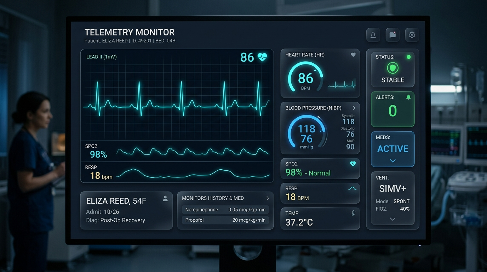
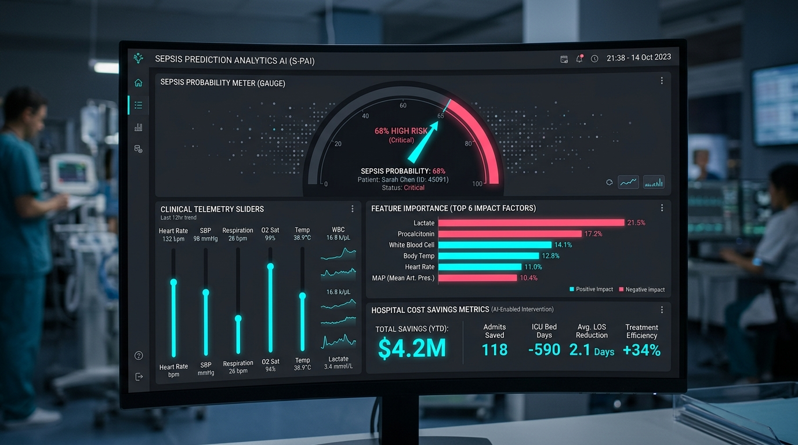
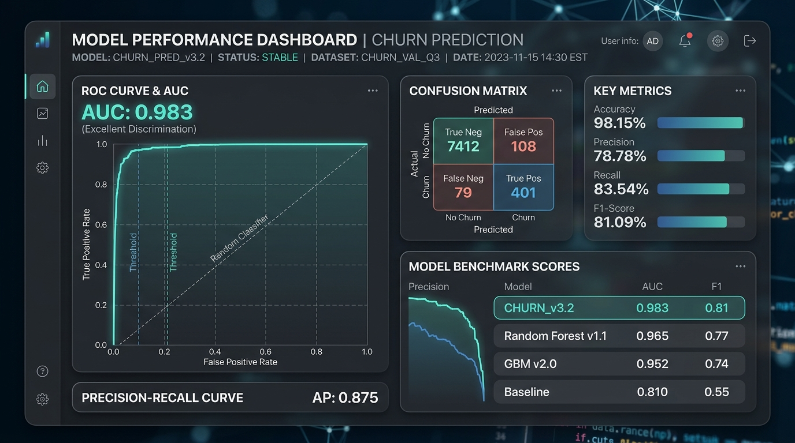

# 06 | Project Screenshots & Technical Visualizations

High-resolution visual assets for Devpost submission verification:

## 1. Live ICU Telemetry Desk & 60fps Waveform Visualizer

*Real-time continuous lead II ECG waveform, MAP, SpO2, and empirical patient profile switching.*

---

## 2. Predictive Decompensation Risk Engine & Simulator

*Interactive parameter perturbation sliders, sepsis decompensation probability gauge, and feature importances.*

---

## 3. Machine Learning Model Benchmark Suite (ROC-AUC 0.983)

*ROC curve evaluation, confusion matrix, precision-recall metrics, and benchmark comparison.*
